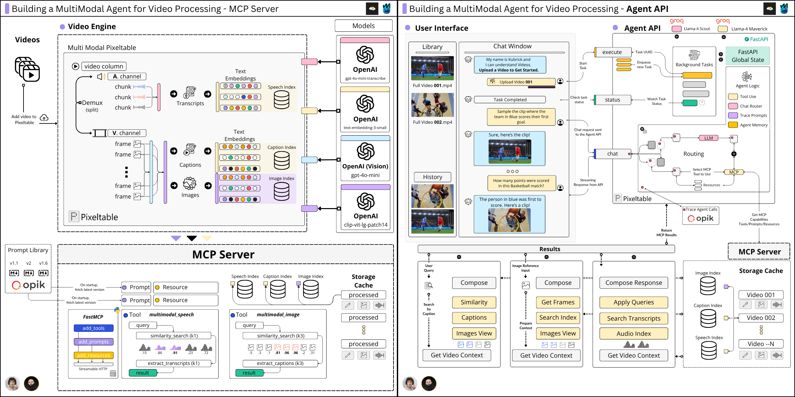
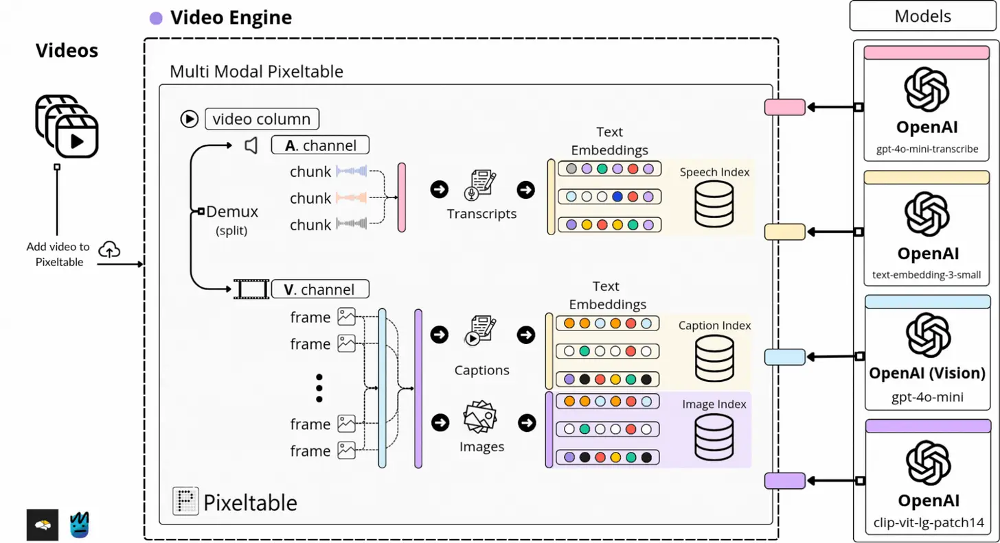
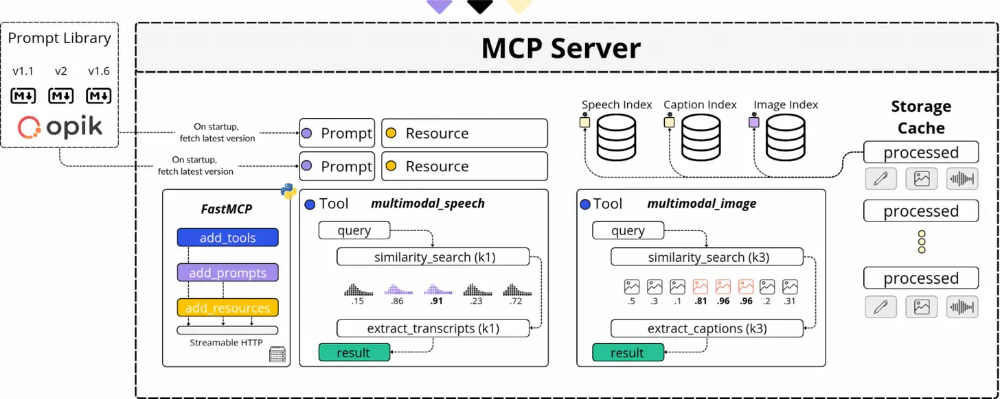
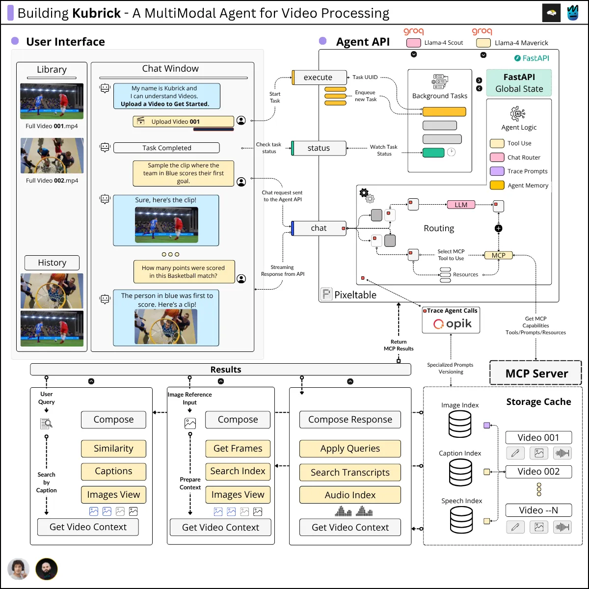
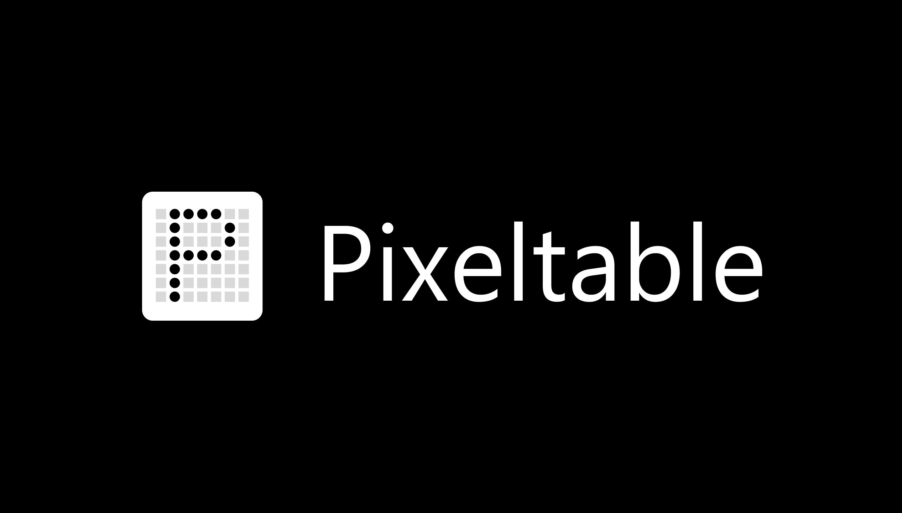

<h1 align="center">Kubrick Course</h1>

    
    <h4 align="center" >Hi Dave...</h4>

    <h4 align="center">Learn to build AI Agents that can understand images, text, audio and videos.</h3>

 A <b>free, Open-source</b> course by <a href="https://theneuralmaze.substack.com"> The Neural Maze </a> and <a href="https://neuralbits.substack.com">Neural Bits</a> in collaboration with <a href="https://github.com/pixeltable">Pixeltable</a> and <a href="https://github.com/comet-ml/opik">Opik</a>

 

 

---

## 📖 About This Course
Tired of tutorials that just walk you through connecting an existing MCP server to Claude Desktop? 

Yeah, us too.

That's why we built **Kubrick AI**, an MCP Multimodal Agent for video processing tasks. Yes! You read that right. 

> 💡 Agents + Video Processing ... and MCP! 

This course, is a collaboration between The Neural Maze and Neural Bits (from now on, "The Neural Bros"), and it's built for developers who want to go beyond the basics and build serious, production-ready AI Systems. In particular, you'll:

* Learn how to build an MCP server for video processing using Pixeltable and FastMCP

* Design a custom, Groq-powered agent, connected to your MCP server with its own MCP client

* Integrate your agentic system with Opik for full observability and prompt versioning

## 🖊️ What you'll learn
* Learn how to use Pixeltable for multimodal data processing and stateful agents

* Create complex MCP servers using FastMCP: expose resources, prompts and tools

* Apply prompt versioning to your MCP server (instead of defining the prompts in the Agent API)

* Learn how to implement custom MCP clients for your agents

* Implement an MCP Tool Agent from scratch, using Llama 4 Scout and Maverick as the LLMs

* Use Opik for MCP prompt versioning

* Learn how to implement custom tracing and monitoring with Opik

> 🚀 No shortcuts. No fluff. Let's learn by doing. 

---

## 💻 What You'll Do:

Completing this course, you'll learn how to design and enable Agents to understand multimodal data, across images, video, audio and text inputs all within a single system. 

Specifically, you'll get to:

- Build a complex Multimodal Processing Pipeline
- Build a Video Search Engine and expose its functionality to an Agent via MCP (Model Context Protocol)
- Build a production ready API to power the Agent.
- Integrate LLMOps principles and best software engineering practices.
- Learn about video, embeddings, streaming APIs, Vision Language Models (VLMs) and more.

After completing this course, you'll have built your own Kubrick Agent with a HAL themed spin-off, to play the role of a new set of eyes and ears:

<video src="https://github.com/user-attachments/assets/ef77c2a9-1a77-4f14-b2dd-e759c3f6db72"/></video>

---

## Getting Started

Kubrick is **not** a simple tutorial. So, to get this system up and running, there are a few things you need to do first.

We have detailed the steps to get you started, in this [GETTING_STARTED.md](GETTING_STARTED.md) file.

> 💡 Having Kubrick running is just the first step! Now that you have it up and running, it's time to actually understand how it works (see [Course Syllabus](#-course-syllabus)).

---

| Publication | Description | Subscribe |
|:---:|---|:---:|
| <a href="https://neuralbits.substack.com/" aria-label="Neural Bits"> 
**Neural Bits**</a>
 | Learn about industry standards and production-ready AI Engineering. |  |
| <a href="https://theneuralmaze.substack.com/" aria-label="The Neural Maze"> 
**The Neural Maze**</a> </a> | Learn to build AI Systems that actually work, from principles to production. Delivered every Wednesday. |  |

---

## 🧑‍🎓 Who is this course for?
You'll get the most of this course by building it yourself, from the ground up. 
The course components are structured to cover key concepts, and showcase how to build on top of them, towards AI Systems.

| Target Audience |	Skills you'll get |
| ----- | ------------------|
| ML/AI Engineers |	Build complex MCP Servers, learn to apply AI Models to Video, Images and Speech.|
| Software Engineers | Learn to connect AI Components with APIs, building end-to-end agentic applications.|
| Data Engineers/Scientists | Learn to design an AI System, managing Video/Audio/Image data processing and structure.

Regardless of your experience or title, this course aims to unpack complex topics in practical terms and concepts you could understand, learn and apply - helping you to build a complete AI system.

## 🎓 Prerequisites
In this section, we outlined a few requirements and nice-to-haves to improve your learning experience while taking this course.
| Category | Label | Description |
|----------| ----- | ----------- |
| Programming Skills (Beginner) | Requirement | Understanding of Programming in general, and the Python language syntax.
| AI/ML Concepts (Beginner) | Nice to Have | Understanding the basic concepts behind AI, AI Models and AI Systems.
| LLMs, MCP, Agents | Nice to Have | Perfect if you know about them, not a problem if you don't. We'll teach and explain it step by step.
| Laptop/PC with any OS | Requirement | AI Models inference requires compute. To overcome that, we'll mainly use API based models.|

The overall level of this course is Beginner/Intermediate, but don't worry. We'll aim to explain every component step by step designed for a larger audience.

## 💰 What's the cost?
This course and its materials are open-source and completely free, thanks to our sponsors, Pixeltable and Opik! 

You'll be able to run Kubrick examples while staying at 0 cost. That's because we'll use OpenAI and Groq for our LLM and VLM calls, which offer freemium plans as such:

| Provider | Free Credits |
| -------- |  ----------- |
| OpenAI   |  $5 on first sign-up |
| Groq | 500,000 tokens / day

> [!NOTE]  
> In this setup, for running the Kubrick Agent example - the freemium plans are enough.

## 📚 Course Syllabus
The Kubrick Agent open-source course consists of five comprehensive modules, covering concepts, system design, tooling, and hands-on implementation.

To get the most out of this course, we recommend:

- Clone this repository.
- Follow the Get Started Sections of each module.
- Read the module articles to understand each component.
- Follow the Video Lessons for hands-on implementation.
- Set up the code and run the project.

| Module No. | Written Lesson (Link) |  Description | Code |
| - | -------------- | ------------ | ----------- |
| 0 |  | Short course introduction and overview. Outlining the basic components  | N/A 
| 1 |  | Diving into the core components of the multimodal processing pipeline, covering video, images, text, and audio data. | [kubrick-mcp](kubrick-mcp)
| 2 |  | Building the Kubrick MCP Server with FastMCP. Covering MCP protocol (transport, communication), capabilities, tools, resources, and prompts. Adding Opik Integration and MCP Inspector for efficient debugging and local testing. | [kubrick-mcp](kubrick-mcp)
| 3 |  | Building the Kubrick MCP Agent from scratch. Memory layer implementation with Pixeltable and MCP Client with FastMCP. Understanding how to translate MCP Tools into specific provider tools (Groq) | [kubrick-api](kubrick-api)

## Sponsors
|  |  |
|:---:|:---:|
|  | |
| 
**Pixeltable**   is the only Python framework that provides incremental storage, transformation, indexing, and orchestration of your multimodal data.
 | 
**Opik**  LLM Evaluation platform helps you build, evaluate, and optimize LLM systems that run better, faster, and cheaper
 

## Contributors
---

  <table>
    <tr>
      <td align="center">
        <a href="https://github.com/MichaelisTrofficus">
           
          <b>Miguel Otero Pedrido</b>
        </a> 
        AI / ML Engineer
        

         
          
        

      </td>
      <td align="center">
        <a href="https://github.com/arazvant">
           
          <b>Alex Razvant</b>
        </a> 
        AI / ML Engineer
        

         
          
        

      </td>
    </tr>
  </table>

---

| Publication | Description | Subscribe |
|:---:|---|:---:|
| <a href="https://neuralbits.substack.com/" aria-label="Neural Bits"> 
**Neural Bits**</a>
| Learn about industry standards and production-ready AI Engineering. |  |
| <a href="https://theneuralmaze.substack.com/" aria-label="The Neural Maze"> 
**The Neural Maze**</a> </a> | Learn to build AI Systems that actually work, from principles to production. Delivered every Wednesday. |  |

